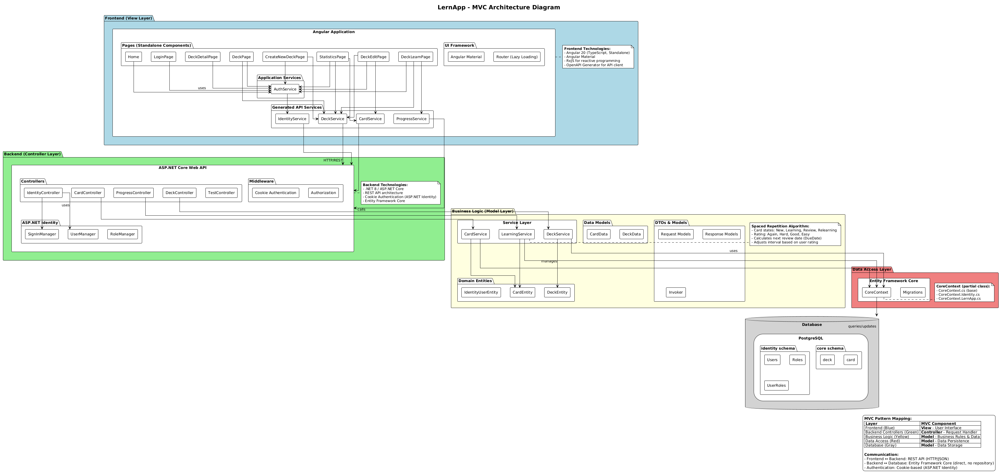
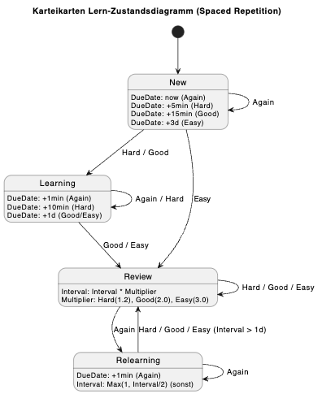
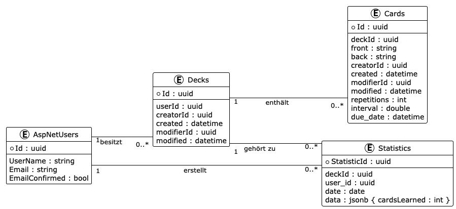

# LernApp - Dokumentation

Diese Dokumentation beschreibt die Architektur, den Entwurf und die Implementierung der LernApp, einer webbasierten Anwendung zum Lernen mit Karteikarten basierend auf dem Spaced Repetition Prinzip.

## Inhaltsverzeichnis

1. [Einleitung](#1-einleitung)
2. [Grundlagen](#2-grundlagen)
3. [Anforderungen](#3-anforderungen)

    * [Use Cases](#use-cases)
    * [User Stories](#user-stories)
    * [Requirements](#requirements)
4. [Software-Architektur](#4-software-architektur)
5. [Implementierung](#5-implementierung)
6. [Qualitätssicherung & Deployment](#6-qualitätssicherung--deployment)
7. [Fazit](#7-fazit)
8. [Anhang: How to Run](#anhang-how-to-run)

---

## 1. Einleitung

### Motivation

Physische Karteikarten sind oft mühsam zu transportieren, schwer zu organisieren und nicht mehr zeitgemäß. Studierende stehen häufig vor dem Problem, dass klassische Lernmethoden, wie das wiederholte Lesen von Skripten, nur zu kurzfristigem Erfolg führen. Digitale Lösungen bieten hier enorme Vorteile durch Algorithmen, die den Lernprozess optimieren.

### Zielsetzung

Ziel dieses Projekts war die Entwicklung einer webbasierten Lernkarten-App unter dem Namen **LernApp**. Der Fokus der Entwicklung lag dabei auf einer sauberen **Software-Architektur** mit klarer Trennung von Frontend und Backend. Ein weiteres Kernziel war die Implementierung eines **Spaced Repetition Algorithmus**, um die Lerneffizienz der Nutzer signifikant zu steigern.
Für den Nutzer soll eine ansprechende und intuitiv bedienbare Benutzeroberfläche geschaffen werden, welche die Verwaltung der Lerninhalte so einfach wie möglich gestaltet.

---

## 2. Grundlagen

### Detaillierte Problemstellung

Das menschliche Gehirn vergisst Informationen exponentiell. Um Informationen langfristig zu speichern, müssen sie in optimalen Abständen wiederholt werden. Die LernApp adressiert genau dieses Problem, indem sie dem Nutzer Karten genau dann wieder vorlegt, bevor er sie zu vergessen droht.

### Technologieauswahl & Begründung

Die Anwendung ist in zwei Hauptbereiche unterteilt: **Frontend** und **Backend**.

| Bereich        | Technologie               | Begründung                                                                                                                         |
|----------------|---------------------------|------------------------------------------------------------------------------------------------------------------------------------|
| **Backend**    | **.NET 8 (ASP.NET Core)** | Hohe Performance, Typsicherheit (C#), Entity Framework Core für Datenzugriff. Saubere REST-Schnittstelle über Web API.             |
| **Frontend**   | **Angular 20**            | Komponenten-basiert, typsicher durch TypeScript, gute Wartbarkeit. Angular Material für konsistentes UI-Design.                    |
| **Datenbank**  | **PostgreSQL**            | Relational, leistungsfähig, gut für strukturierte Daten (User, Decks, Cards, Lernfortschritt). Läuft isoliert im Docker-Container. |
| **API Client** | **OpenAPI Generator**     | Generiert Services/Models aus Swagger-Spezifikation und reduziert Inkonsistenzen zwischen Client und Server.                       |
| **Auth**       | **ASP.NET Identity**      | Etablierter Standard. Cookie-Authentication (HttpOnly) erhöht Sicherheit gegenüber LocalStorage-JWTs.                              |

#### Warum kein SQLite?

Ursprünglich war für einen Prototypen eine lokale Datenhaltung (z. B. SQLite) naheliegend. Da die Anwendung jedoch als **Webapp mit getrenntem Backend** umgesetzt wurde, werden Daten **serverseitig** persistiert und über eine REST-API bereitgestellt. SQLite als rein lokale Speicherung im Browser ergibt in diesem Setup keinen Mehrwert, weil:

* der Browser keine klassische, robuste lokale DB-Nutzung wie eine native App bietet (und man sonst wieder lokale Storage-Ansätze bräuchte),
* der zentrale Vorteil des Client-Server-Modells (Accountgebundene Daten, saubere Trennung, einheitliche Backend-Logik) unterlaufen würde,
* Backend-Features wie Authentifizierung, Autorisierung und konsistente Geschäftslogik serverseitig umgesetzt sind.

---

## 3. Anforderungen

## Use Cases

**UC1 – Benutzerkonto**

* Benutzer öffnet die App und navigiert zur Registrierungsseite
* Gibt E-Mail und Passwort ein und erstellt ein neues Konto
* Benutzer meldet sich über die Login-Seite an
* Session wird serverseitig über Cookies (HttpOnly) verwaltet
* Benutzer bleibt über mehrere Requests hinweg authentifiziert

**UC2 – Deck-Verwaltung (Erstellen / Umbenennen)**

* Benutzer navigiert zur Deck-Übersicht
* Klickt auf „Neues Deck erstellen“
* Gibt einen Namen für das Deck ein
* Deck wird dem Benutzer zugeordnet und im Backend gespeichert
* Benutzer kann den Namen eines bestehenden Decks ändern
* *(Hinweis: Decks können in der aktuellen Version nicht gelöscht werden.)*

**UC3 – Karten-Verwaltung (CRUD)**

* Benutzer öffnet ein Deck und klickt auf „Karte hinzufügen“
* Formular erscheint mit Eingabefeldern für Frage und Antwort (optional Tags)
* Karte wird gespeichert und dem Deck zugeordnet
* Benutzer kann Karten bearbeiten
* Benutzer kann Karten löschen (mit Bestätigung)

**UC4 – Lern-Session**

* Benutzer wählt ein Deck aus
* Klickt auf „Lernen“
* System lädt algorithmisch ausgewählte, fällige Karten (Spaced Repetition)
* Frage wird angezeigt, Antwort kann aufgedeckt werden

**UC5 – Bewertung / Lernfortschritt**

* Benutzer bewertet seine Antwort mit: Again / Hard / Good / Easy
* System berechnet das nächste Wiederholungsintervall
* Kartenstatus und Fälligkeitsdatum werden aktualisiert

---

## User Stories

**Benutzerkonto**

* Als neuer Nutzer möchte ich mich registrieren und anmelden können, damit meine Decks und mein Lernfortschritt dauerhaft gespeichert und geschützt sind.

**Deck- und Kartenverwaltung**

* Als Nutzer möchte ich Decks erstellen und umbenennen können, damit ich meine Lerninhalte thematisch strukturieren kann.
* Als Nutzer möchte Karten mit Frage und Antwort erstellen und bearbeiten können, damit ich meinen Lernstoff individuell zusammenstellen kann.
* Als Nutzer möchte Karten löschen können, damit mein Deck übersichtlich bleibt.

**Lernmodus**

* Als Lernender möchte ich eine Lernsession starten können, damit ich gezielt mit meinen Karten lernen kann.
* Als Lernender möchte ich nur die aktuell fälligen Karten sehen, damit ich meine Lernzeit effizient nutze.

**Bewertung**

* Als Nutzer möchte ich angeben können, wie gut ich eine Antwort wusste, damit die App das nächste Wiederholungsintervall automatisch anpasst.

---

## Requirements

| ID      | Name                    | Priorität | Beschreibung                                                                                | Use Case | Status                                                  |
|---------|-------------------------|-----------|---------------------------------------------------------------------------------------------|----------|---------------------------------------------------------|
| REQ-001 | Benutzer registrieren   | MUST      | Benutzer kann ein Konto mit E-Mail und Passwort erstellen                                   | UC1      | umgesetzt                                               |
| REQ-002 | Benutzer anmelden       | MUST      | Benutzer kann sich authentifizieren; Session wird per HttpOnly-Cookie verwaltet             | UC1      | umgesetzt                                               |
| REQ-003 | Deck erstellen          | MUST      | Benutzer kann ein neues Deck anlegen und benennen                                           | UC2      | umgesetzt                                               |
| REQ-004 | Deck umbenennen         | MUST      | Benutzer kann den Namen eines bestehenden Decks ändern                                      | UC2      | umgesetzt                                               |
| REQ-005 | Karte erstellen         | MUST      | Benutzer kann Karten mit Frage und Antwort erstellen                                        | UC3      | umgesetzt                                               |
| REQ-006 | Karte bearbeiten        | MUST      | Benutzer kann Inhalte bestehender Karten ändern                                             | UC3      | umgesetzt                                               |
| REQ-007 | Karte löschen           | MUST      | Benutzer kann Karten aus einem Deck entfernen (mit Bestätigung)                             | UC3      | umgesetzt                                               |
| REQ-008 | Lern-Session starten    | MUST      | Benutzer kann eine Lernsession für ein Deck starten                                         | UC4      | umgesetzt                                               |
| REQ-009 | Fällige Karten anzeigen | MUST      | System zeigt algorithmisch ausgewählte, fällige Karten an                                   | UC4      | umgesetzt                                               |
| REQ-010 | Antwort bewerten        | MUST      | Benutzer bewertet seine Antwort (Again/Hard/Good/Easy)                                      | UC5      | umgesetzt                                               |
| REQ-011 | Spaced Repetition Logik | MUST      | System berechnet basierend auf Bewertung das nächste Intervall und Fälligkeitsdatum         | UC5      | umgesetzt                                               |
| REQ-012 | Persistente Speicherung | MUST      | Alle Daten werden serverseitig in einer Datenbank gespeichert und einem Benutzer zugeordnet | Alle     | umgesetzt                                               |
| REQ-013 | REST-Kommunikation      | MUST      | Frontend kommuniziert über eine REST-API mit dem Backend                                    | Alle     | umgesetzt                                               |
| REQ-014 | Responsive Web-UI       | MUST      | Benutzeroberfläche funktioniert auf verschiedenen Bildschirmgrößen                          | Alle     | umgesetzt                                               |
| REQ-015 | Import/Export von Decks | CAN       | Export/Import von Decks (z. B. JSON)                                                        | —        | **geplant, nicht umgesetzt (zeitlich nicht geschafft)** |

---

### Kommunikationsfluss (Beispiele)

#### 1. Deck erstellen

UI (create-new-deck-page.ts)
↓ Nutzer gibt Name ein und klickt "Erstellen"   
↓ Aufruf: `DeckService.createDeck(deckModel)`    
Business Logic (Frontend)   
↓ Sendet `POST /api/deck` an Backend   
Controller (DeckController.cs)   
↓ Empfängt Request, ruft `DeckService.CreateDeckAsync()`   
Business Logic (Backend)   
↓ Validiert Eingabe, erstellt `Deck` Entität   
Data Access (CoreContext)   
↓ `Decks.Add()` -> `SaveChanges()` persistiert in PostgreSQL DB   

#### 2. Karte bewerten (Lernen)

UI (deck-learn-page.ts)
↓ Nutzer klickt Bewertung (z.B. "Good")   
↓ Aufruf: `ProgressService.updateProgress(cardId, rating)`   
Business Logic (Frontend)   
↓ Sendet `POST /api/learning/update/{cardId}` mit Rating   
Controller (ProgressController.cs)   
↓ Empfängt Request, ruft `LearningService.LogProgressAsync()`   
Business Logic (LearningService.cs)   
↓ Berechnet neues Intervall/Fälligkeit (Spaced Repetition)   
↓ Aktualisiert `Card` Status   
Data Access (CoreContext)   
↓ `SaveChanges()` speichert neuen Kartenstatus in DB   

#### 3. Login / Auth (Cookie-Session)

UI (login-page.ts)   
↓ Nutzer gibt E-Mail/Passwort ein und klickt "Login"   
↓ Aufruf: `AuthService.login(credentials)`   
Business Logic (Frontend)   
↓ Sendet `POST /api/identity/login` an Backend   
Identity Controller (IdentityController.cs)   
↓ Validiert Credentials via ASP.NET Identity   
↓ Setzt `Identity.Application` Cookie (HttpOnly)   
Browser   
↓ Sendet Cookie automatisch bei weiteren Requests mit   
Backend Middleware / Controller   
↓ Validiert Cookie → setzt `HttpContext.User`   
Frontend Guard/Interceptor   
↓ Bei 401: Weiterleitung zur Login-Seite (kein 302 Redirect)   

---

## 4. Software-Architektur


*(Siehe: [doc/uml/architecture.puml](doc/uml/architecture.puml))*

### Architektur-Pattern

Die Anwendung folgt grundsätzlich einer **Client-Server-Architektur**, wobei das **MVC (Model-View-Controller)** Pattern logisch aufgeteilt und interpretiert wird:

* **Model (Backend & Database)**:
  Entitäten (`Card`, `Deck`, `Identity`) und Business-Regeln (Lern-Algorithmus). Vollständig vom Frontend entkoppelt.
* **Controller (Backend API)**:
  ASP.NET Core Controller als REST-Schnittstelle. Keine UI-Logik, nur Request/Response + Orchestrierung.
* **View (Frontend)**:
  Angular SPA rendert Daten, steuert UI-Flows und nutzt Services zur Kommunikation.

### Trennung von Frontend und Backend

1. **Unabhängiger Betrieb**: Separate Projekte, getrennt build-/deploybar (Docker).
2. **Austauschbarkeit**: Backend liefert JSON, Frontend ist austauschbar.
3. **Erweiterbarkeit**: Weitere Clients (Mobile App) könnten dieselbe API nutzen.

---

## 5. Implementierung

### Backend (.NET 9)

Das Backend stellt Geschäftslogik und Datenhaltung bereit.

* **Controller Layer**: REST-Endpoints (z.B. `CardController`, `DeckController`, `IdentityController`).
* **Service Layer**:

    * `DeckService` / `CardService`: CRUD-Operationen.
    * `LearningService`: Spaced Repetition Algorithmus.

        * **Zustände**: `New`, `Learning`, `Review`, `Relearning`
        * **Bewertung**: Again/Hard/Good/Easy → neue Fälligkeit (`DueDate`) + Intervall (`Interval`)
        * **Sonderfall Again**: Fälligkeit wird sehr kurzfristig gesetzt (sofort/nahezu sofort), sodass Karten in aktiven Sessions schnell wieder auftauchen können.



* **Data Access Layer**: `CoreContext` (EF Core) mit PostgreSQL.

    * Zwei Schemas: `identity` (User/Rollen) und `core` (Decks/Karten/Fortschritt).

### Authentifizierung & Sicherheit

* **Cookie-Authentication** (HttpOnly) statt JWT in LocalStorage
* API sendet bei nicht-authentifizierten Requests korrekt **401 Unauthorized** (statt 302 Redirect), damit das Frontend sauber reagieren kann.

### Frontend (Angular 20)

* **Standalone Components**

    * `Pages`: `Home`, `DeckPage`, `CreateNewDeckPage`, `LoginPage`
* **Kommunikation** über generierte Services (OpenAPI Generator)
* **Internationalisierung** via `@ngx-translate` (DE/EN)

### Datenbank-Design


*(Siehe auch lokal: [doc/uml/erm.puml](doc/uml/erm.puml))*

Beziehungen:

* **User → Deck (1:n)**
* **Deck → Card (1:n)**
* **Deck → Statistic (1:n)**

---

## 6. Qualitätssicherung & Deployment

### Qualitätssicherung

* Manuelle Tests der Kern-Workflows:

    * Registrierung/Login
    * Deck erstellen/umbenennen
    * Karten erstellen/bearbeiten/löschen
    * Lernsession starten, Bewertung, erneute Fälligkeit prüfen
* Grundlegende Validierung der API über Swagger (manuelles Testen der Endpoints)

*(Optional, falls ihr’s wirklich gemacht habt: Hier könnt ihr noch 1–2 Sätze zu vorhandenen Unit-Tests ergänzen.)*

### Deployment & Datenhaltung

* Betrieb via **Docker Compose**

    * Backend (ASP.NET Core)
    * PostgreSQL Datenbank
* **Persistenz-Hinweis**: Daten bleiben erhalten, solange die DB in einem persistenten Docker-Volume liegt. Ohne Volume (oder bei `docker compose down -v`) werden Daten beim Entfernen der Container/Volumes gelöscht.

---

## 7. Fazit

Das Projekt **LernApp** konnte erfolgreich umgesetzt werden. Die zentralen Anforderungen (Muss-Kriterien) wurden erfüllt. Durch den Einsatz moderner Technologien (.NET 8, Angular 20) und Tools (Docker, OpenAPI Generator) entstand eine stabile und wartbare Anwendung.

**Nicht umgesetzt (geplant):** Import/Export von Decks wurde aus Zeitgründen nicht mehr fertiggestellt.

---

## Anhang: How to Run

### Voraussetzungen

* Docker & Docker Compose installiert.

### Starten der Anwendung

1. Repository klonen.
2. Im Root-Verzeichnis ausführen:

   ```bash
   docker compose -f docker/docker-compose.yml up -d --build
   ```
3. **Frontend**: Erreichbar unter `http://localhost:4200`
4. **Backend API**: Erreichbar unter `http://localhost:5001` (Swagger UI unter `/swagger`)

### Lokale Entwicklung

* **Backend**: `LernApp-Backend.sln` öffnen. `appsettings.json` anpassen (Connection String).
* **Frontend**: `npm install` und `ng serve` im `Frontend/LernApp` Ordner ausführen.
